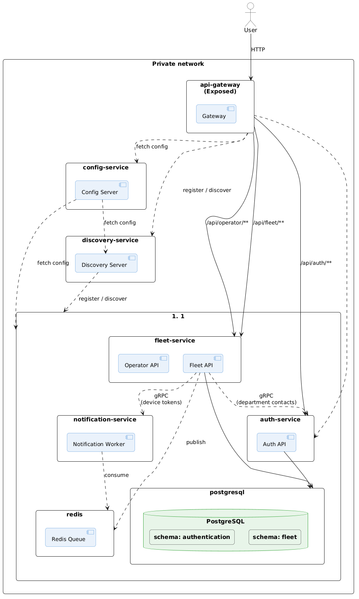

# Système de Gestion Intégré pour Wilaya

## Vue d'ensemble
Système de gestion microservices complet pour l'administration de wilaya, comprenant la gestion des utilisateurs, des demandes de services, des équipements de télécommunication et des workflows d'approbation.

### Architecture

